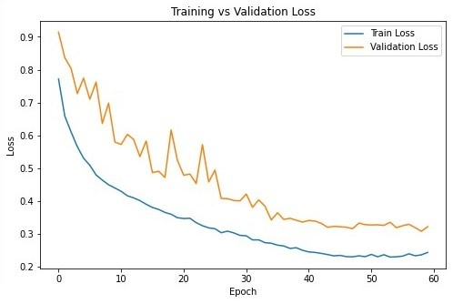
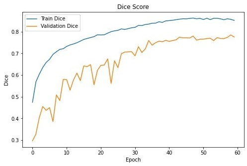
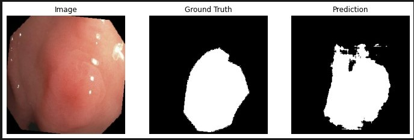
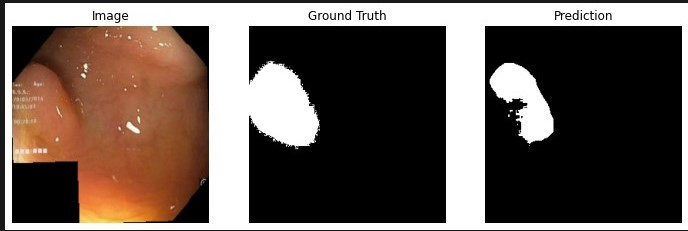
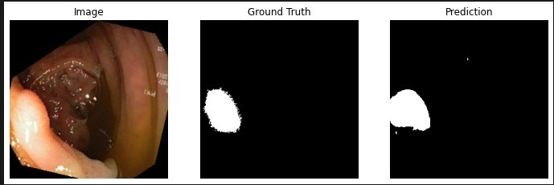

# Lightweight-Polyp-Segmentation
This project implements a lightweight U-Net style architecture for medical image segmentation, specifically designed for polyp segmentation on the Kvasir-SEG dataset.

The goal of this project is to design a compact segmentation network that can run on low-memory GPUs while maintaining good performance.

The proposed architecture is called MiniUNet.

--------------------------------------------------

## Model Complexity

| Model | Parameters | FLOPs |
|------|------|------|
| U-Net | 31M | 54.73G |
| MiniUNet (Ours) | **0.20M** | **1.31G** |

MiniUNet is approximately:

• **155× fewer parameters**  
• **41× fewer FLOPs**

--------------------------------------------------

## Dataset

This project uses the **Kvasir Polyp Segmentation Dataset**.

Dataset link:

https://datasets.simula.no/kvasir-seg/

--------------------------------------------------

## Evaluation Metrics

The following segmentation metrics are used:

• Dice Score  
• Intersection over Union (IoU)

--------------------------------------------------

## Results on Kvasir Dataset

| Model | IoU | Dice |
|------|------|------|
| **MiniUNet** | **0.6542** | **0.7848** |

--------------------------------------------------

## Training Configuration

| Parameter | Value |
|------|------|
| Image Size | 256 × 256 |
| Batch Size | 4 |
| Optimizer | AdamW |
| Learning Rate | 1e-3 |
| Epochs | 60 |
| Loss Function | Hybrid (Dice + BCE) |

--------------------------------------------------

## Installation

Clone this repository:

```bash
git clone https://github.com/MahdisHassani/Lightweight-Polyp-Segmentation.git
cd Lightweight-Polyp-Segmentation
```

Install dependencies:

```bash
pip install -r requirements.txt
```

--------------------------------------------------

## Training

Run training script:

```bash
python train.py
```

The model automatically saves the **best checkpoint** during training.

--------------------------------------------------

## Training Curves





--------------------------------------------------

## Model Predictions







--------------------------------------------------

## Hardware

The model was designed to run on **low-memory GPUs**.

Test environment:

GPU: 2GB VRAM  
Framework: PyTorch

Tested on a GPU with 2GB VRAM.
